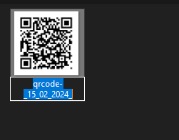

# Gerador_QRCode
Este é um simples gerador de códigos QR escrito em Python. Ele permite que o usuário insira qualquer texto ou link e gera instantaneamente um código QR correspondente com a data na descrição do QR.

